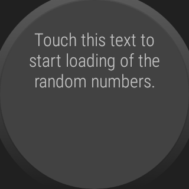

# WearOS-App: "Lotto Numbers"

WearOS app which randomly chooses 6 numbers in the range between 1 and 49 for the Germany lottery.
The six numbers are based on real random data obtained from the 
[*"ANU Quantum Random Numbers Server"*](http://qrng.anu.edu.au/index.php).

 

----
## Screenshots

   

Screenshots were taken from emulator.

 

----
# License

See the [LICENSE file](LICENSE.md) for license rights and limitations (BSD 3-Clause License).
